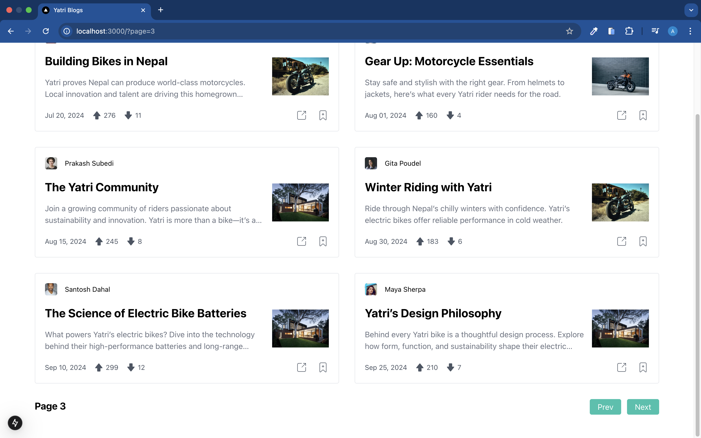

# Assignment for Frontend Developer (Intern/Junior) at Yatri Design Studio Pvt. Ltd.

## Overview

This project is a dynamic blog platform that retrieves blog data from a Next.js Server API and presents it in a responsive layout. Users can browse a list of blog posts, each featuring a title, summary, and date. Clicking on a post redirects them to a dedicated blog details page for an in-depth reading experience.

## Live Demo

🔗 **Live Site:** [LIVE](https://yatri-frontend-task.vercel.app/)

## Technologies Used

- **Next.js**: Utilized for server-side rendering, routing, and API handling.
- **Tailwind CSS**: Provides responsive and utility-first styling.
- **React**: Enables component-based UI development for a dynamic user experience.
- **TypeScript**: Ensures type safety and improves maintainability.
- **Unsplash API**: Supplies mock image data via `next/image` for a visually appealing blog experience.
  >

## Installation

To run the project locally, follow these steps:

```bash
# Clone the repository
git clone https://github.com/abhishek1025/yatri-frontend-task

# Navigate to the project directory
cd yatri-frontend-task

# Install dependencies
npm install

# Run the development server
npm run dev
```

## Implementation

### 1. Homepage (Blog List Page)

- Fetches and displays blog posts from a ` /api/blogs?page=&limit&searchText=`
- Each post includes a **title, summary, and date**.
- Clicking a post redirects the user to the **blog detail page**.
- Implements **loading states** using a **skeleton UI**.
- Posts are displayed in a **responsive grid layout** using Tailwind CSS.


### 2. Blog Post Detail Page

- Dynamic route (`/blog/[slug]`) for each blog post.
- Displays **full blog content, title, and date of creation**.
- Implements **loading states** using a **skeleton UI**.


### 3. Search Functionality

- **Real-time filtering** of blog posts by title.
- Search is **case-insensitive**.
- Implements **debounce** for better performance.
- Shows **"No posts found"** if no results match.


### 4. Pagination

- Displays **6 posts per page**.
- Allows users to navigate between pages for a better browsing experience.
- 
  
  
  

### 5. Error Handling (Bonus)

- Shows an error message if ** data fetching fails, returns null, or the server is unreachable **.


## Blog Schema

The API returns blog data in the following format:

```typescript
export type BlogType = {
  id: string;
  title: string;
  fullText: string;
  coverImg: string;
  createdAt: string;
  author: string;
  authorPicture: string;
  upVotes: string;
  downVotes: string;
  summary: string;
};
```

## API Response Structure

### 1. Fetch All Blogs (**GET** `/api/blogs?page=&limit=&searchText=`)

- \*Description:\*\* Retrieves a paginated list of blog posts.
- **Query Parameters:**
  - `page` (number) – The page number for pagination.
  - `limit` (number) – The number of blog posts per page.
  - `searchText` (string, optional) – Filters blogs based on the title.
- **Response Structure:**

```json
{
  "message": "string",
  "data": {
    "blogs": ARRAY_OF_BLOG_DETAILS,
    "hasNextPage": "boolean",
    "hasPrevPage": "boolean",
    "totalPages": "number",
    "currentPage": "number"
  }
}
```

### 2. Fetch Blog Details ( **GET** `/api/blogs/:blogId`)

- **Description:** Retrieves details of a single blog post by its `blogId`.
- **Response Structure:**

```json
{
  "message": "string",
  "data": BLOG_DETAILS
}
```

---
